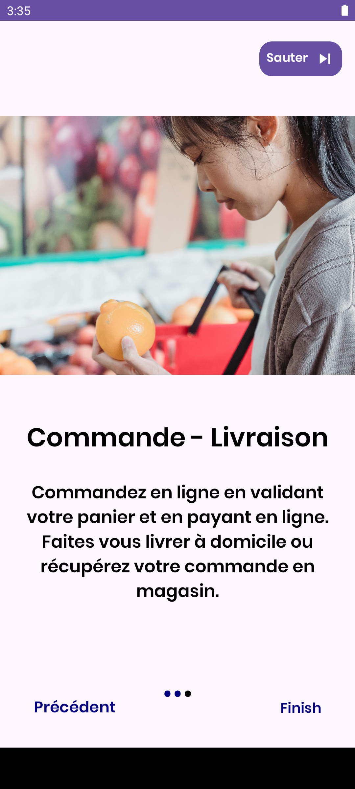

THIAM Papa & HAJJI Chaimae & Saminou Nadira

L3 Informatique

# Projet Dev Smartphone  - Jibou

## Sommaire :
>Chapitre 1 : Présentation du projet 

    I. Contexte du projet 
    II. La problématique 
    III. Proposition de solution 
    IV. Etat d’existant : 
    1. Des applications similaires 
    2. Critiques 
    3. La nouveauté de l’application 

> Chapitre 2 : Analyse et conception

    I. Introduction

    II. Spécifications des besoins fonctionnels

    III. Modélisation :

        1. Cas d’utilisation 

        2. Diagrammes de classe 

        3. Diagramme de séquence

> Chapitre 3 : Mise en œuvre de projet 

    I. Introduction

    II. Technologies utilisées

    III. Présentation de l’application :

> Chapitre 4 : Test 

>Chapitre 5 :  conclusion 

> Chapitre 6 :  problème rencontré 

### Chapitre 1 : Présentation du projet 

   - #### I. Contexte du projet 

Le projet JIBOU a été initié dans le but de fournir une solution innovante aux restaurants pour améliorer leur gestion des stocks. Dans le secteur de la restauration, la gestion efficace des stocks est cruciale pour assurer la satisfaction des clients, la rentabilité et le bon fonctionnement global de l'établissement. Cependant, de nombreux restaurants se retrouvent confrontés à des défis liés à la quantité de recettes à gérer, ce qui se traduit souvent par des achats excessifs ou des oublis de produits essentiels. Face à cette réalité, il est devenu impératif de proposer une solution qui simplifie et optimise le processus de gestion des stocks pour les restaurants, tout en minimisant les risques d'erreurs et les pertes financières associées.

  - ####  II. La problématique 
La gestion des stocks dans l'industrie de la restauration présente plusieurs défis majeurs. En particulier, la multitude de recettes à gérer conduit souvent à une complexité accrue dans la gestion des produits nécessaires. Cette complexité se traduit par un risque accru d'achats excessifs ou d'oublis de produits essentiels, ce qui peut entraîner une insatisfaction client et des pertes financières pour l'établissement. La difficulté à maintenir un inventaire précis et à jour est une source de frustration constante pour de nombreux restaurateurs, mettant en évidence la nécessité urgente de trouver une solution efficace et adaptée à leurs besoins spécifiques.

   - #### III. Proposition de solution 
Face à cette problématique, notre solution consiste à proposer un outil d'inventaire simple, rapide et intuitif pour les restaurants, tout en respectant leurs habitudes établies. L'objectif est de fournir aux restaurateurs un moyen pratique et efficace de gérer leurs stocks, en réduisant au minimum les risques d'erreurs et les pertes associées. En adoptant une approche centrée sur l'utilisateur, notre solution vise à simplifier le processus de gestion des stocks, tout en offrant une expérience utilisateur fluide et intuitive. En permettant aux restaurateurs de gérer facilement leurs inventaires, notre solution contribuera à améliorer l'efficacité opérationnelle des établissements et à garantir une meilleure satisfaction client.
   
   - #### IV. Etat d’existant 
   #### 1. Des applications similaires 

    • Yokitup :
Yokitup est une application de gestion des stocks conçue spécifiquement pour les restaurants. Elle offre des fonctionnalités pour suivre les niveaux de stock, gérer les fournisseurs, et optimiser les commandes.

    • Easilys : 
Easilys est une plateforme de gestion des stocks et des opérations pour les restaurants et les établissements de restauration collective. Elle propose une gamme complète de fonctionnalités, y compris la gestion des stocks, des recettes, des achats, de la production, et du personnel

    • Melba :
Melba est une application de gestion des stocks et des recettes conçues pour les professionnels de la restauration. Elle offre des fonctionnalités pour suivre les niveaux de stock, créer des recettes et des menus, et gérer les commandes fournisseurs.

    • Symb :
Symbioz est une solution de gestion des stocks et des opérations destinées aux établissements de restauration rapide et de restauration assise. Elle propose des outils pour suivre les stocks en temps réel, planifier les commandes, gérer les menus et analyser les performances opérationnelles. 

   #### 2. Critiques
 Dans l'ensemble, bien que Yokitup, Easilys, Melba et Symbioz offrent des fonctionnalités de gestion des stocks pour les restaurants, chacune présente des inconvénients potentiels. Certaines peuvent être complexes à utiliser ou nécessiter des coûts élevés, tandis que d'autres pourraient manquer de flexibilité ou de fonctionnalités spécifiques à certains types d'établissements. De plus, la qualité du service client et la disponibilité du support technique peuvent varier, ce qui pourrait affecter la satisfaction globale de l'utilisateur.

   #### 3. La nouveauté de l’application 
La principale nouveauté de notre application JIBOU réside dans sa capacité à offrir une solution de gestion des stocks simple, rapide et intuitive, spécifiquement conçue pour répondre aux besoins des restaurants. Contrairement à d'autres applications qui peuvent être complexes ou nécessiter des ajustements majeurs dans les processus existants, JIBOU se distingue par sa facilité d'utilisation et son interface conviviale.

### Chapitre 2 : Analyse et conception

   - #### I. Modélisation Jibou

#### 1. Cas d’utilisation 

#### 2. Modélisation SQL

#### 3. Diagramme de classe :

### Chapitre 3 : Mise en œuvre de projet 
    
- #### I. Introduction 

>Dans cette section, nous allons présenter l'application de gestion d'inventaire et d'achat pour les restaurants, nommée Jibou. Cette application vise à fournir aux restaurants un outil simple, rapide et intuitif pour gérer leur inventaire et leurs achats, sans perturber leurs routines habituelles. Jibou intègre des fonctionnalités telles que la création de listes de produits, la gestion des listes de courses et le suivi des achats.

- #### II. Technologies utilisées

    - Android Studio (Java, XML) :

        Java est utilisé pour la logique métier de l'application Android.
        XML est utilisé pour la conception de l'interface utilisateur.

- PostgreSQL :

        PostgreSQL est utilisé comme base de données relationnelle pour stocker les informations des utilisateurs, des produits et des listes de courses.

- Création d'API avec Flask (Python) :

        Flask, un framework Web Python, est utilisé pour créer une API qui permet à l'application Android de communiquer avec la base de données PostgreSQL.
        Cette API facilite la manipulation des données côté serveur, notamment l'ajout, la modification et la suppression d'informations.

- #### III. Présentation de l’application
L'application Jibou est conçue pour offrir une expérience conviviale aux utilisateurs tout en simplifiant leur gestion d'inventaire et d'achats. Voici un aperçu de l'interface utilisateur principale:

>**Page de chargement :**

    Lorsque l'application est lancée, une page de chargement s'affiche brièvement, indiquant que l'application est en cours de chargement.

>**Page d'accueil :**

    La page d'accueil de l'application présente les options de connexion et d'inscription pour les utilisateurs.
    Un bouton "Comment ça marche ?" est également disponible pour fournir une explication rapide de l'objectif et des fonctionnalités de l'application.

   >><<
 

>**Page Se Connecter**

Les utilisateurs peuvent accéder à la page de connexion où ils saisissent leur adresse e-mail et leur mot de passe. Ils ont également la possibilité de cocher une case pour se souvenir de leurs informations de connexion et un lien pour récupérer leur mot de passe en cas d'oubli. L'application vérifie ces informations en envoyant une requête GET à l'API utilisateur pour vérifier si l'utilisateur existe.

>**Page S'inscrire**

La page d'inscription permet aux utilisateurs de saisir leur prénom, nom, adresse e-mail et mot de passe. Ils ont également la possibilité de s'inscrire avec leur compte Google ou de se connecter directement s'ils possèdent déjà un compte. Une fois les données saisies, elles sont envoyées à l'API via une requête POST pour créer un nouveau compte utilisateur.

 -
 - 
 

>**Page Comment ça Marche ?**

La page "Comment ça marche ?" fournit une explication concise et intuitive des fonctionnalités de l'application, permettant aux utilisateurs de comprendre rapidement son utilisation. Elle offre un aperçu des principales fonctionnalités sans alourdir l'expérience utilisateur, favorisant ainsi une adoption plus rapide de l'application.

 -
 - 
 

### Espace Client

Une fois connecté à son espace, l'utilisateur peut accéder à diverses fonctionnalités :

#### Profil
L'utilisateur peut voir son nom et télécharger une photo de profil.

#### Liste des Produits
Une liste de produits avec leur image est affichée. L'utilisateur peut sélectionner chaque produit pour afficher plus de détails et cocher une case pour les ajouter à son panier.

#### Menu de Navigation
Un menu de navigation permet à l'utilisateur d'accéder aux différentes tâches qu'il peut effectuer :

- **Profil**: Accès aux informations personnelles et possibilité de les modifier.
- **Commandes**: Affichage de l'historique des commandes passées.

 

- **Favoris**: Liste des produits marqués comme favoris.
- **Panier**: Affichage des produits sélectionnés pour 
l'achat.

 

- **Aide**: Accès à la section d'aide pour obtenir des informations supplémentaires.

 

- **Contact**: Possibilité de contacter le support client.

 

- **Fournisseur (Carte)**: Affichage d'une carte pour localiser les fournisseurs à proximité.

- **Paramètres**: Modification des préférences de l'application.

 

- **Déconnexion**: Permet à l'utilisateur de se déconnecter de son compte.

 

   >><<
 

#### Option d'Ajout en Bas de Page
Une option d'ajout en bas de page est disponible pour permettre à l'utilisateur d'ajouter facilement des produits sur sa liste.

 

**Conclusion :**

Dans le cadre de ce projet, l'objectif était de développer une application conviviale et fonctionnelle pour la gestion d'inventaire et d'achats, tout en offrant une expérience utilisateur intuitive. Malgré quelques défis rencontrés en cours de route, l'application a été réalisée avec succès.                

L'intégration d'une base de données PostgreSQL et d'une API pour la communication avec l'application a permis d'enrichir les fonctionnalités et de rendre l'expérience utilisateur plus dynamique. Cela a également ajouté une couche de réalisme au projet, simulant des conditions plus proches de celles rencontrées dans des applications réelles.

L'interface utilisateur a été conçue de manière à être attrayante et facile à utiliser, avec des pages clairement organisées et des fonctionnalités bien intégrées. La possibilité d'ajouter des produits avec une sélection de catégorie et une interface de navigation fluide contribue à rendre l'expérience utilisateur agréable et intuitive.

Cependant, certains défis ont été rencontrés, notamment l'intégration de fonctionnalités payantes telles que Google Maps, ainsi que la gestion de l'authentification utilisateur et la sécurité des données. Malgré cela, l'application a été développée avec succès et constitue une base solide sur laquelle de futures améliorations et fonctionnalités pourraient être construites.

En conclusion, ce projet a permis de mettre en pratique divers concepts de développement d'applications mobiles, de gestion de bases de données et d'intégration d'API, tout en offrant une expérience d'apprentissage enrichissante.   